# 🏙️ Civic Complaint Portal

[](https://react.dev/)
[](https://vitejs.dev/)
[](https://firebase.google.com/)
[](https://leafletjs.com/)
[](LICENSE)


deploy link :https://civicconnect26.netlify.app
A production-grade, full-stack municipal grievance redressal web application connecting **Citizens, Municipal Administrators, and On-Ground Field Technicians** into a unified, transparent resolution ecosystem.

---

## 🎯 Problem Statement & Solution

| Challenge | Civic Complaint Portal Solution |
| :--- | :--- |
| **Grievance Blackholes**: Citizens report issues into fragmented systems with zero progress visibility. | **Real-Time Audit Trails**: Live 6-stage lifecycle tracking with timestamped status logs. |
| **Municipal Bottlenecks**: Admins struggle to triage, deduplicate, and route grievances efficiently. | **Smart Geospatial Triage**: Automated duplicate matching via GPS Haversine distance and semantic analysis. |
| **Field Disconnect**: Field workers lack structured task queues, site geolocations, and resolution proof logging. | **Dedicated Worker Workstations**: Mobile-friendly GIS route guidance, photo proof uploads, and completion audits. |

---

## 🔄 Strict 6-Stage Resolution Lifecycle

The platform strictly enforces the municipal grievance resolution lifecycle with zero skipped stages:

```mermaid
graph LR
    A[01. SUBMITTED] -->|Admin Review| B[02. VERIFIED]
    B -->|Route & Assign| C[03. ASSIGNED]
    C -->|Worker Accept| D[04. ACCEPTED]
    D -->|Crew on Site| E[05. IN_PROGRESS]
    E -->|Upload Evidence| F[06. RESOLVED]

    style A fill:#FEF3C7,stroke:#D97706,stroke-width:2px,color:#92400E
    style B fill:#E0E7FF,stroke:#4338CA,stroke-width:2px,color:#3730A3
    style C fill:#E0F2FE,stroke:#0284C7,stroke-width:2px,color:#075985
    style D fill:#CCFBF1,stroke:#0D9488,stroke-width:2px,color:#115E59
    style E fill:#DBEAFE,stroke:#2563EB,stroke-width:2px,color:#1E40AF
    style F fill:#DCFCE7,stroke:#16A34A,stroke-width:2px,color:#166534
```



---

## 👥 Role-Based Workstations

### 1. 👤 Citizen Portal (`/citizen/*`)
- **Lodge Grievance**: Category selection, description, photo upload, and interactive pin-drop on OpenStreetMap with instant Nominatim reverse-geocoding.
- **My Complaints**: Scoped view displaying grievances filed exclusively by the authenticated citizen.
- **Resolution Tracking**: Live step-by-step audit trail from submission to verified field resolution evidence.
- **Public Complaint Tracker**: Instant search by Complaint ID (`#CMP-2026-XXXX`) on the landing page.

### 2. 🏛️ Municipal Admin Portal (`/admin/*`)
- **Master Operations Dashboard**: City-wide grievance metrics, department SLAs, and SLA performance charts.
- **Complaint Verification**: Inspect photo evidence, verify grievance validity, and detect potential duplicate reports nearby.
- **Workforce Delegation**: Assign complaints to municipal departments and provisioned field technicians.
- **Interactive City Map**: Real-time Leaflet GIS map with status-coded markers and inspect popups.

### 3. 🛠️ Field Worker Portal (`/worker/*`)
- **Work Order Queue**: Task inbox filtered by technician assignment (`ACCEPTED`, `IN_PROGRESS`).
- **Ground Navigation**: OpenStreetMap directions and site landmark details.
- **Evidence Upload & Closeout**: Mandatory post-repair photograph upload and resolution notes before marking `RESOLVED`.

---

## 🛠️ Technology Stack & Architecture

- **Frontend Framework**: React 19 + Vite + React Router v7
- **Styling**: Vanilla CSS Design System with accessible high-contrast design tokens
- **Backend & Realtime Sync**: Firebase Firestore (NoSQL) + Firebase Storage
- **Geospatial & Mapping**: Leaflet + OpenStreetMap + Nominatim Reverse Geocoding API
- **Duplicate Detection**: Haversine Great-Circle Distance + Jaccard Semantic Description Matching
- **Icons**: Lucide React

```
┌─────────────────┐       ┌─────────────────┐       ┌─────────────────┐
│ Citizen Portal  │       │  Admin Portal   │       │  Worker Portal  │
└────────┬────────┘       └────────┬────────┘       └────────┬────────┘
         │                         │                         │
         └─────────────────────────┼─────────────────────────┘
                                   │
                   ┌───────────────▼───────────────┐
                   │    ComplaintContext / Auth    │
                   └───────────────┬───────────────┘
                                   │
        ┌──────────────────────────┴──────────────────────────┐
        ▼                                                     ▼
┌───────────────────────────────┐             ┌───────────────────────────────┐
│       Firebase Firestore      │             │    OpenStreetMap / Leaflet    │
│  - complaints collection      │             │  - GPS Geocoding & Nominatim  │
│  - users & departments        │             │  - Interactive Pin Dropping   │
└───────────────────────────────┘             └───────────────────────────────┘
```

---

## 📁 Clean & Modular Project Structure

```
citizen-complaint-portal/
├── .github/
│   ├── ISSUE_TEMPLATE/bug_report.md
│   └── pull_request_template.md
├── public/
│   ├── logo.png                # Official product logo emblem
│   └── hero-bg.mp4             # High-contrast ambient hero video
├── src/
│   ├── assets/                 # SVGs, images, and static resources
│   ├── components/
│   │   ├── common/             # Reusable UI (Button, Card, Input, Modal, Map, Badges)
│   │   └── layout/             # Navbar, Sidebar, CitizenLayout, AdminLayout, WorkerLayout
│   ├── config/
│   │   └── firebaseConfig.js   # Environment configuration & credential validation
│   ├── constants/
│   │   └── index.js            # Immutable roles, categories, statuses, and lifecycle rules
│   ├── context/
│   │   ├── AuthContext.jsx     # Role-based user authentication & persistence
│   │   └── ComplaintContext.jsx# Grievance lifecycle state machine & Firestore listeners
│   ├── hooks/
│   │   ├── useAuth.js          # Authentication hook
│   │   └── useComplaints.js    # Grievance lifecycle hook
│   ├── pages/
│   │   ├── admin/              # Admin dashboard, master list, GIS map, department config
│   │   ├── auth/               # Citizen registration, citizen/admin/worker sign-in
│   │   ├── citizen/            # Issue report, personal complaints, grievance details
│   │   ├── worker/             # Task workstation, site inspect, evidence resolution
│   │   └── LandingPage.jsx     # Public landing page with video hero & live tracker
│   ├── routes/
│   │   ├── AppRoutes.jsx       # Route declarations
│   │   └── ProtectedRoute.jsx  # Role-based route guard
│   ├── services/
│   │   ├── authService.js      # Authentication & user lookup
│   │   ├── complaintService.js # Firestore CRUD & lifecycle transitions
│   │   ├── departmentService.js# Department roster & assignment
│   │   ├── duplicateDetectionService.js # Geospatial & semantic duplicate matcher
│   │   ├── notificationService.js # In-app notification dispatcher
│   │   ├── storageService.js   # Cloud storage photo upload handler
│   │   └── userService.js      # User profile management
│   ├── styles/
│   │   ├── components.css      # Component stylesheets
│   │   └── index.css           # Global tokens, reset, typography, and utility classes
│   ├── utils/
│   │   ├── complaintUtils.js   # Lifecycle validation & scoping helpers
│   │   ├── duplicateDetection.js # Haversine & Jaccard algorithms
│   │   └── helpers.js          # Date formatters & text truncators
│   ├── App.jsx
│   └── main.jsx
├── .env.example
├── CONTRIBUTING.md
├── LICENSE
└── package.json
```

---

## ⚡ Quick Start & Installation

### 1. Prerequisites
- **Node.js** (v18.0.0 or higher)
- **npm** (v9.0.0 or higher)

### 2. Clone and Install
```bash
git clone https://github.com/sirranjeevi/Innotech_HS2026-190.git
cd Innotech_HS2026-190
npm install
```

### 3. Setup Environment
```bash
cp .env.example .env
```
Provide your Firebase Web App credentials in `.env` (or run with built-in development defaults).

### 4. Start Development Server
```bash
npm run dev
```
Open your browser at `http://localhost:5173`.

### 5. Production Build Verification
```bash
npm run build
```

---

## 🔑 Pre-Configured Demo Credentials

| Role | Username / Email | Password | Access Route |
| :--- | :--- | :--- | :--- |
| **Citizen** | `ananya` or `citizen` | *password123* | `/citizen/login` |
| **Admin** | `admin` or `admin@civic.gov` | *admin123* | `/admin/login` |
| **Field Worker** | `rajesh` or `worker` | *worker123* | `/worker/login` |

*(You can also register a brand new Citizen account via `/citizen/register`)*

---

## 🏆 Hackathon Project Information

- **Event**: Hackspora 2026
- **Team**: Innotech (`HS2026-190`)
- **Repository**: [sirranjeevi/Innotech_HS2026-190](https://github.com/sirranjeevi/Innotech_HS2026-190)
- **License**: MIT
